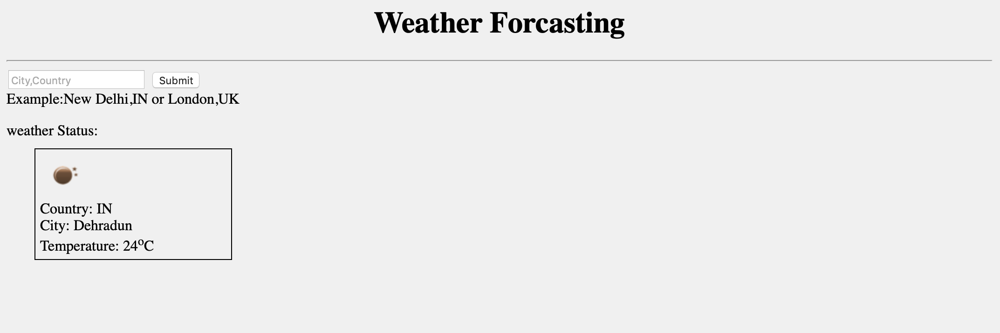

This project is being inspired by Indian Farmer hardwork. This project can be used for creating smart Green-house for temperature and vegition contol.
-------------------------- 
 project Part 1:(IOT Based)
--------------------------
Hardware requirement:
1x Ardino UNO microcontroller.
1X Bluetooth Module. RN-14.
1X Analog TMP-36 Thermostat.
1X battery.

Note: Required good internet connectivity, nodeJs and www.plotly.com account(open source account for data analysis)

step 1) Download IOT repository with required IOT Tools.
step 2) simulate ardino uno coding.ino to ardino and change serial port if required.
step 3) install plotly with "node install plotly" and run index.js and reading update.js with node.
step 4) setup reading update.js with plotly account.

---------------------
Application setup:
--------------------
1) install node 
2) open Terminal 
3) Install node Module using npm command on specific folder "weatherforecasting". 
    Execute to install npm express framework, ejs framework,request module and body-parser module 
    3.1) npm install express 
    3.2) npm install request 
    3.3) npm install body-parser 
    3.4) npm install ejs 
    or unzip node_module.zip file in root folder of project.
    
4) Run node server.js on folder weatherforecasting 
5) open Link http://localhost:3000/ 
6) Test Application. 

<b>Application preview :</b> 
Demo hosting Link: <a hreaf="https://weather-forcast123.herokuapp.com">https://weather-forcast123.herokuapp.com</a>

